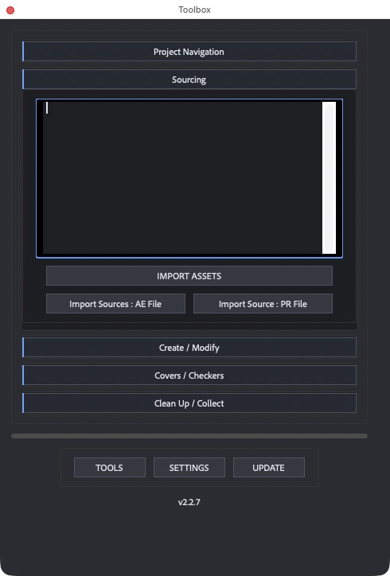
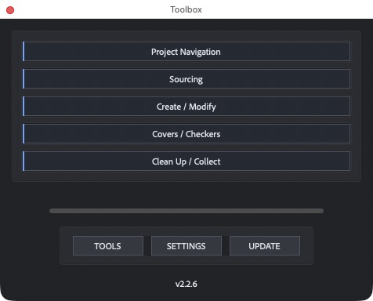
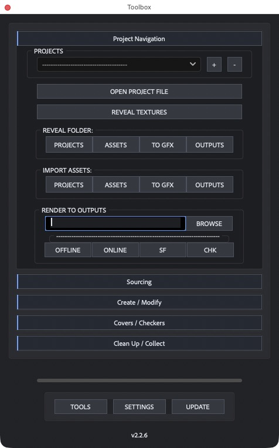
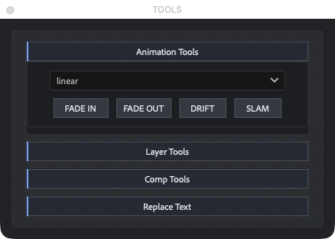
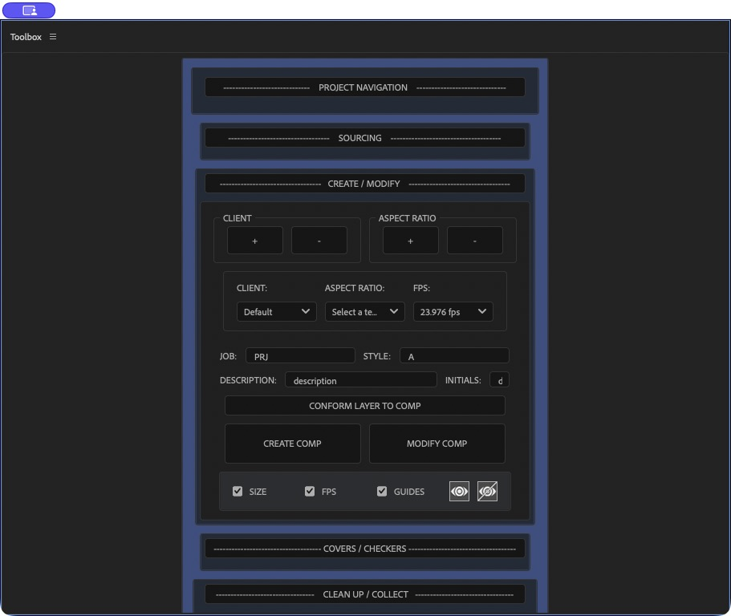
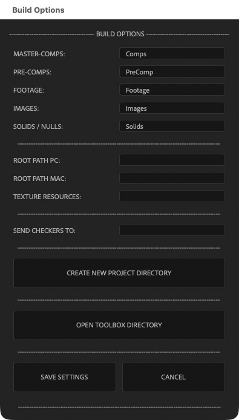

# AE-Toolkit

A dockable production toolbox for Adobe After Effects: import assets, build and modify compositions, create covers and checkers, organize projects, and run everyday layer and animation tools.

**Version 2.2.10** restores After Effects legacy-parser compatibility for the repaired asset importer. It accepts normal file paths, file URLs, quoted paths, cross-platform root mapping, and folder-plus-filename lists without restricting imports to a short file-extension list. Missing or invalid entries are reported while the remaining valid files import.

[Installation](#installation) · [Quick start](#quick-start) · [Source-project lookup](docs/sourcing.md) · [Organizer guide](docs/organizer.md) · [Settings and recovery](docs/settings.md) · [Validation & limitations](docs/known-issues.md) · [Changelog](CHANGELOG.md)



## Interface

Module headers stay attached to darker bordered bodies. Collapsing a module removes its content spacing while preserving the control order.





The main panel now has a vertical scrollbar on the right. Keep multiple modules expanded and drag the scrollbar to reach lower controls. The scroll range updates when modules change or the panel is resized. Wheel-event support depends on the host; editable fields keep their own scrolling behavior.

The Tools popup uses the same compact headers and connected dark module bodies.



## Installation

1. Download `AE-Toolkit-v2.2.10.zip` from the [latest release](https://github.com/danrac/AE-Toolkit/releases/latest). You can also download or clone this repository.
2. Open the repository's `ScriptsUI Panels` directory. Copy **both** `Toolbox.jsx` and `Toolbox_Assets` into your After Effects **ScriptUI Panels** directory:

   | Platform | Typical installation directory |
   | --- | --- |
   | macOS | `/Applications/Adobe After Effects <version>/Scripts/ScriptUI Panels/` |
   | Windows | `C:\Program Files\Adobe\Adobe After Effects <version>\Support Files\Scripts\ScriptUI Panels\` |

3. Keep the script and assets next to each other, with their names unchanged:

   ```text
   ScriptUI Panels/
   ├── Toolbox.jsx
   └── Toolbox_Assets/
       ├── HelperScripts/
       ├── ImageResources/
       ├── SaveData/
       └── aom.aep
   ```

4. In After Effects settings/preferences, under **Scripting & Expressions**, enable **Allow Scripts to Write Files and Access Network** for settings, logs, and file-based workflows. The installation's `Toolbox_Assets/SaveData` folder must also be writable by your account.
5. Restart After Effects, then open **Window → Toolbox.jsx**. Dock the panel wherever you prefer.

The repository directory is named `ScriptsUI Panels`; the actual After Effects directory is named `ScriptUI Panels`. Copy its contents, rather than nesting the repository directory inside After Effects.

### Updating an existing installation

Close Toolbox before replacing its code. Back up your existing `Toolbox_Assets` directory, then replace `Toolbox.jsx` and merge in the updated helpers and resources. **Keep your existing `SaveData` directory**—it contains custom folder names, client/project presets, and user preferences. Also retain any custom swatch palettes or null animation presets under `HelperScripts`.

In **2.2.7 and later**, click **UPDATE** to download and install the latest stable GitHub release automatically. Version 2.2.6 uses a package picker: download the release ZIP first and choose it there. Older installations need the manual upgrade above. Settings and custom presets are preserved, and replaced files are backed up. See [updating Toolbox](docs/updating.md).

## Quick start

1. Click a section heading to expand its controls. Keep several modules open and use the right-side scrollbar to reach lower controls.
2. Open **SETTINGS** and enter the five project folder names you want. Click **SAVE SETTINGS**.
3. Expand **CLEAN UP / COLLECT**, select **XAV Organizer**, and click **ORGANIZE**.
4. To preserve a folder and everything inside it, select that folder in the Project panel first. XAV also preserves individually selected items.

Organization changes folders inside the After Effects project; it does not move source files on disk. The separate **CREATE NEW PROJECT DIRECTORY** command creates disk folders.

## Workflows

| Section | Use it for | What to have ready |
| --- | --- | --- |
| Project Navigation | Navigate a configured production project and its folders | A project entry and matching local/network root paths |
| Sourcing | Import files from pasted paths; find source projects from rendered media | Absolute file paths, or a folder line followed by filenames; embedded source metadata for source-project lookup |
| Create / Modify | Build named compositions or update selected compositions | Client/aspect-ratio presets, frame rate, and naming fields |
| Covers / Checkers | Generate covers, guides, and checker compositions | Source comps and the appropriate templates/render presets |
| Clean Up / Collect | Organize, rename, duplicate, reduce, consolidate, or collect | Project-panel selections appropriate to the operation |
| Tools | Layer selection, animation helpers, text replacement, and templates | A composition and relevant layers selected |
| Settings | Customize folder names, root paths, texture paths, and checker email | Your own production paths; leave unused integration fields blank |

Some render and shared-production functions depend on studio-specific presets and paths. Basic organization does not require a shared drive. See [cleanup workflows](docs/cleanup.md) for the scope of reduction, native consolidation, and collection.

### Import assets

Expand **SOURCING**, paste an absolute file path on each line, then choose **IMPORT ASSETS**. The importer accepts macOS, Windows, UNC, and `file://` paths, including spaces and quotes. You can also enter a folder path followed by bare filenames; use a trailing slash if the folder is not mounted on the current machine. Configured Windows/Mac roots map a path from the other platform when the direct path is unavailable. It imports every valid file and lists any missing or invalid lines afterward. **Import Sources: AE File** reads explicit project links from selected videos, still images and image sequences, including matching `.xmp` sidecars. Select the found projects in the results window and click **IMPORT**. Missing or stripped metadata cannot be reconstructed from an image alone. The **PR File** workflow remains separate. See the [source-project guide](docs/sourcing.md).

<details>
<summary>Screenshot: Sourcing</summary>


</details>

### Create or modify compositions

Expand **CREATE / MODIFY**, choose the client, aspect ratio, and frame rate, and enter the naming fields. Choose **CREATE COMP** for a new composition. To modify existing comps, select them in the Project panel and use **MODIFY COMP** with the desired **SIZE**, **FPS**, and **GUIDES** options enabled.

<details>
<summary>Screenshot: Create / Modify</summary>



</details>

### Organize projects

**XAV Organizer** uses your five custom folder names. **DMS 16x9**, **DMS 9x16**, **DMS 4x5**, and **DMS 1x1** build a fixed production hierarchy with the chosen aspect-ratio folders. Selecting a DMS ratio changes the folder structure, not composition dimensions.

See the [organizer guide](docs/organizer.md) for routing rules, selection behavior, and examples.

### Customize settings

Open **SETTINGS** to edit folder names and optional production paths. Version 2.2.5 saves settings only when you choose **SAVE SETTINGS**, supports hyphens and Unicode, and backs up valid previous settings before replacing them.

<details>
<summary>Screenshot: Settings</summary>



</details>

See [settings and recovery](docs/settings.md) for backup locations and legacy-format compatibility.

## Compatibility and validation

The refreshed panel, Settings dialog, native Collect Files handoff, and automatic release installation were checked in **After Effects 2026 on macOS**. The live updater downloaded and installed 2.2.7, then correctly reported it was up to date on a second check. Sixty-three automated checks cover organization, settings, cleanup, pasted-asset importing, updater/network failure handling, source-project discovery, and scrolling. ZIP extraction was also exercised using macOS tools and real temporary files. Windows command construction is tested, but execution on Windows and earlier After Effects versions remains unverified.

Run the tests with a recent Node.js version from the repository root:

```sh
node "ScriptsUI Panels/Toolbox_Assets/Tests/organizer.test.js"
node "ScriptsUI Panels/Toolbox_Assets/Tests/cleanup.test.js"
node "ScriptsUI Panels/Toolbox_Assets/Tests/scroll.test.js"
node "ScriptsUI Panels/Toolbox_Assets/Tests/update-online.test.js"
node "ScriptsUI Panels/Toolbox_Assets/Tests/source-projects.test.js"
node "ScriptsUI Panels/Toolbox_Assets/Tests/import-assets.test.js"
```

The tests do not launch After Effects or change installed settings. The cleanup suite uses and removes temporary fixtures inside its test directory. See [development and testing](docs/development.md).

## Troubleshooting

| Symptom | Check |
| --- | --- |
| Toolbox is missing from Window | Confirm both install paths and restart After Effects. |
| Script reports a missing include | Install the entire `Toolbox_Assets/HelperScripts` folder, including `UTILITY_BuildPrefs.jsx`. |
| Lower modules are hidden | Scroll down using the main panel’s right-side scrollbar. |
| Settings will not save | Check scripting permissions and write access to `Toolbox_Assets/SaveData`; the dialog reports the failure. |
| Defaults appear instead of custom names | Read the warning, preserve the original settings file, and follow the [recovery guide](docs/settings.md#recovering-settings). |
| Shared paths or render presets fail | Configure your studio's root paths and render/output-module templates. |

## Contributing and license

For bugs, include the After Effects version, operating system, exact error message, selected organizer mode, and a minimal reproduction. Do not include confidential project paths or client footage in public reports.

Licensed under the [BSD 3-Clause License](LICENSE).
