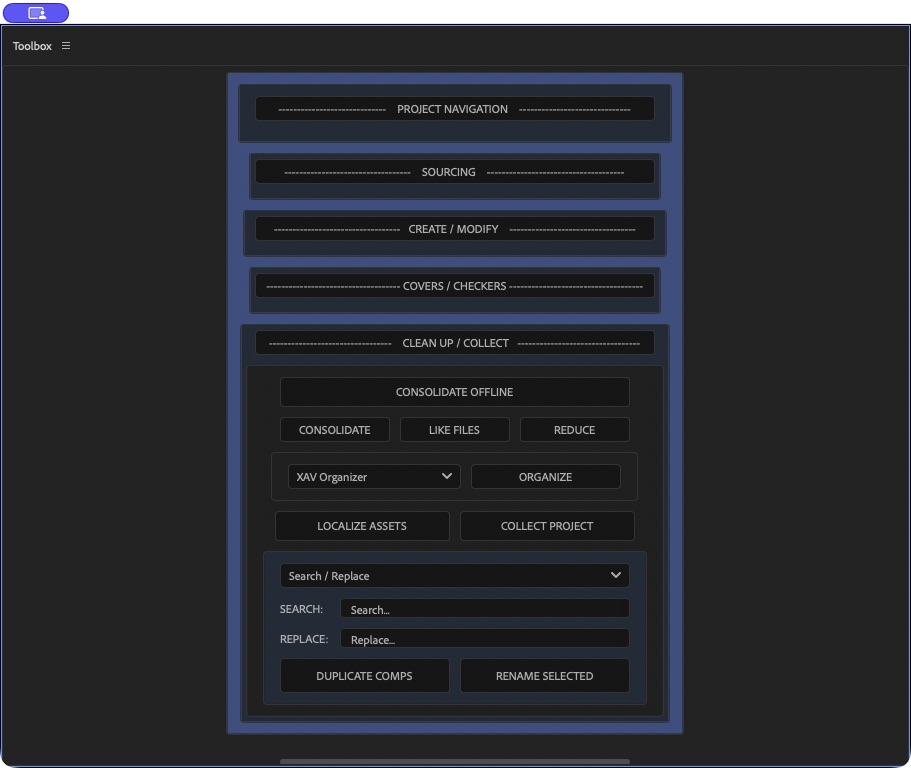

# Project organization

Open **CLEAN UP / COLLECT**, choose an organizer, and click **ORGANIZE**. This rearranges project-panel items; source files on disk stay in place.



## XAV Organizer

The five destinations come from **SETTINGS**. A new installation uses:

| Item | Default destination |
| --- | --- |
| Composition not used inside another composition | `Comps` |
| Composition used inside another composition | `PreComp` |
| Video, image sequences, audio, and other non-still footage | `Footage` |
| Still-image footage | `Images` |
| Solid sources, including null sources | `Solids` |

The distinction between master comps and precomps is based on `usedIn`, not names or render-queue membership. Existing installations retain their own folder names.

### Preserve selected items

Select an item to exclude it from XAV sorting. Select a folder to preserve its entire descendant tree, even when its contents are not individually selected. Outermost preserved items move to the project root; the hierarchy below a selected folder remains intact. Selection flags and labels are retained.

An unselected item is sorted unless it belongs to a selected folder. Old unprotected folders are removed only when empty. A protected folder with the same name as a sorting destination is kept separate, so a second folder with that name may be created intentionally.

## XAV Organizer 2025

Choose **XAV Organizer 2025** for the supplied XAV production layout. It creates the following folders when they are absent and reuses them on later runs:

```text
01_compositions/
├── _PRE/
├── _INDIVS/
└── _SUBS/
02_cuts/
03_assets/
├── Audio/
├── Images/ (psd, png, tiff/tif, ai, svg, jpg/jpeg, exr)
└── Footage/ (mxf, mov, mp4, avi)
04_c4d/
05_AE-import/
Solids/
unsorted/
```

- Nested comps and names matching `_pre_`, `precomp`, `_pc`, or `pc_` go to `_PRE`, except names with XAV exclusion tags such as `_ref` or `_comp`.
- Names matching `_indiv` or `indiv_` go to `_INDIVS`; names matching `_sub`, `sub_`, `subtitle`, or `captions` go to `_SUBS`.
- Footage with `_ref` routes to `02_cuts`; `c4d` files route to `04_c4d`; After Effects / Essential Graphics imports route to `05_AE-import`.
- Recognized images, footage, audio, and solids use the nested destinations above. Unrecognized footage and root-level non-footage items go to `unsorted`.
- Individually selected items stay selected and end at the project root. Selected folders and their descendants retain Toolbox's existing preservation behavior.

This preset is executed inside the same single Toolbox Undo group as the other organizers. It does not start a second Undo group or change `autoFixExpressions`.

## DMS organizers

Choose one of the four ratios to produce this hierarchy (16x9 shown):

```text
1_COMPS/
└── 16x9/
2_PRE_COMPS/
└── 16x9/
3_GFX/
├── AI/
├── C4D/
├── JPEG/
├── LOGOS/
├── MOV/
├── PNG/
├── PSD/
├── SOLIDS/
└── TIF/
4_FOOTAGE/
└── 16x9/
```

Other source extensions create additional uppercase folders under `3_GFX` when needed. The ratio is an organizational choice; it does not resize compositions.

- Selected folders and their descendants are preserved. Their outermost folders move to the project root.
- Selected compositions outside preserved folders go directly into `1_COMPS`.
- Other compositions go into the selected ratio under `1_COMPS` or `2_PRE_COMPS`, based on whether another comp uses them.
- Audio goes into the selected ratio under `4_FOOTAGE`.
- MOV/MP4 footage from a path containing a `06_ToGFX` directory goes into `4_FOOTAGE/<ratio>`; other MOV/MP4 footage goes into `3_GFX/MOV`.
- Still images are classified using their source filename. Renaming an imported PSD in the Project panel does not change its file type. JPG maps to JPEG; TIFF maps to TIF.
- Solids go into `3_GFX/SOLIDS`.

DMS does not treat individually selected footage as an exclusion. Put footage inside a selected folder when it must stay together.

## Errors and Undo

Organization is wrapped in one undo group. If an error occurs, the group is closed and progress is reset; any completed changes remain until you undo them. The error dialog explains this. Focus the Project panel and use After Effects' Undo command when available.

The live automated UI session confirmed error-free folder creation, but did not establish a successful keyboard Undo round trip. Verify Undo on a disposable project before relying on it for production recovery.
