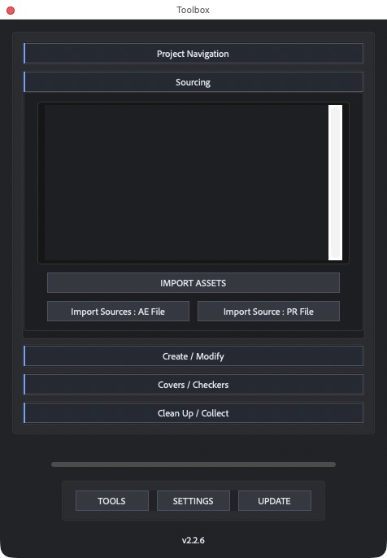

# Find the AE project behind a render

## Videos, still images and image sequences

Select file-based footage in the Project panel and click **Sourcing → Import Sources: AE File**. Toolbox checks embedded XMP and the exact matching sidecars `image.png.xmp` and `image.xmp`. It reads the After Effects `creatorAtom:aeProjectLink/fullPath` field, the older direct `creatorAtom:fullPath` field, and `xmpDM:projectRef/path`. Only explicit `.aep` or `.aepx` paths are used.

The same reader runs for still images and videos. For an imported sequence it reads the footage item's referenced frame and its sidecars, not every frame in the directory. If the link exists only on another frame, import/select that frame separately.

Results show the project path and whether it was found. Available projects are selected initially; use Command/Ctrl-click to adjust the selection, then **IMPORT**. Several renders pointing to the same project produce one entry. Missing projects remain visible but are not imported. Files without a link or with unreadable metadata are reported without stopping other selected files.

Imported projects go into `ImportedProjects`. Matching rendered composition names are moved into `ImportedComps` only inside the newly imported project trees; existing same-name compositions are left alone. Imports are grouped for Undo.

## What an image can tell you

An image may retain a source-project link, but an After Effects render is not guaranteed to contain one. Adobe documents XMP reading for image formats including JPEG, PNG and TIFF, while its **Include Source XMP Metadata** output option is unavailable for some formats. A format's ability to carry XMP does not guarantee that the renderer wrote an AE project path. See [Adobe's XMP documentation](https://helpx.adobe.com/after-effects/desktop/work-with-footage-items/work-with-xmp-metadata/xmp-metadata.html).

Adobe's [ProjectLink specification](https://developer.adobe.com/xmp/docs/xmp-namespaces/xmp-data-types/project-link/) defines a project path and a media type that can include `still`. This is the additional structured link the reader recognizes.

For future renders, enable **Include Project Link** wherever the output format offers it, and retain any related sidecars. **Include Source XMP Metadata** is a separate option and does not make every image export traceable. A screenshot, flattened image, document ID, filename or stripped metadata cannot identify the missing project by itself. Toolbox does not guess a project from those values.

## Moved projects and cross-platform paths

Toolbox tries the recorded path first. If it is missing, configured Windows and Mac root paths from Settings can map the same relative path across platforms. It does not guess server names or substitute arbitrary drives. Mount the original share or correct the configured roots, then scan again.

## Validation

Ten automated checks cover still/sequence selection, canonical links, sidecars, corrupt metadata, missing files, duplicate source projects, root mapping and import isolation. These use simulated metadata objects. `Toolbox_Assets/Tests/source-projects-smoke.jsx` is an optional in-memory Adobe XMP smoke test; it does not modify the open project. Actual rendered-image metadata varies by output format and workflow.

