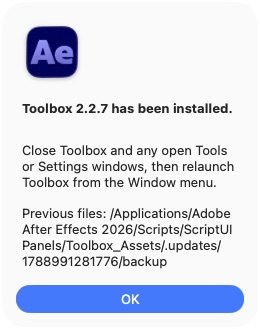

# Updating Toolbox

## Automatic updates in 2.2.7 and later

Click **UPDATE**. Toolbox checks connectivity to GitHub, looks up the latest stable [AE-Toolkit release](https://github.com/danrac/AE-Toolkit/releases/latest), downloads its ZIP, verifies it, and installs the newer version. No file picker or additional install confirmation is needed. A status window shows each stage.

If there is no connection or GitHub cannot be reached, Toolbox alerts and stops. It also reports unavailable releases, rate limits, incomplete downloads and invalid packages. If you already have the latest version, it says so without downloading the ZIP.

After success, close Toolbox and any open Tools or Settings windows, then reopen Toolbox from After Effects' **Window** menu. Restarting After Effects also reloads the scripts.

## First upgrade from older versions

The new automatic updater must be installed once. With the 2.2.6 package picker, download the release ZIP and select it through UPDATE. With earlier versions, follow the [manual upgrade instructions](../README.md#updating-an-existing-installation). Future releases can be installed directly with UPDATE.

## Downloads and validation

The updater uses GitHub's public API without an account or token. It selects `AE-Toolkit-v<version>.zip`; if no matching packaged asset exists, it uses GitHub's source ZIP for that release. Drafts and prereleases are excluded. Release tags and the downloaded script must have matching three-part versions, such as `v2.2.7`.

HTTPS certificate verification stays enabled. Transfers have connection and total timeouts; a partial transfer is rejected even if the server initially returned HTTP 200. Packaged asset length is checked, and GitHub's SHA-256 digest is checked when supplied. Archives are checked for unsafe paths and symbolic links, and all script includes must resolve before installation.

Downloads use macOS curl or Windows curl.exe; extraction uses macOS tools or Windows PowerShell/.NET. Windows execution has not been tested on an actual Windows host.

## Settings and recovery

Updates are limited to `Toolbox.jsx` and its helpers/resources. Saved settings, swatch palettes, null-animation presets, logs and local update packages are preserved. Existing destination files are copied and verified before replacement under:

```text
Toolbox_Assets/.updates/<timestamp>/backup/
```

The main script is installed last. If replacement fails, the updater restores attempted files and removes partially added files. If restoration also fails, it reports the exact paths and backup location. Failed updates never show the success/relaunch message.

Downloaded packages and backups remain available for recovery. Remove older `.updates` folders only when you no longer need them.

## Publishing future releases

Increment `var version` in `Toolbox.jsx`, commit the change, and publish a stable GitHub release with the matching `vX.Y.Z` tag. Attach `AE-Toolkit-vX.Y.Z.zip` containing `ScriptsUI Panels/Toolbox.jsx` and `ScriptsUI Panels/Toolbox_Assets`. Build it from repository files, never personal installed settings. The release must be published, not left as a draft.

## Verified macOS update

The Update button was used in After Effects 2026 to download and install the published 2.2.7 asset. The reopened panel displayed 2.2.7, and a second check reported it was already up to date.


